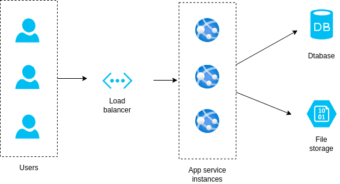
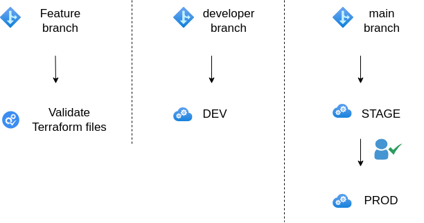

# OperaTerra e-commerce platform

This repository contains the infrastructure definitions for the OperaTerra e-commerce platform. All resources is hosted in Azure and is deployed using Terraform. The platform consist of the following resources.



## Workflow

The repository has a workflow based on three types of branches. All development should be done on feature branches, they can have any name except *developer* or *main*. The developer branch is for integration tests and trigger a deploy to the **DEV** environment. The main branch is the release pipeline and trigger a deploy to the **STAGE** environment. When a a user with deploy privileges approve the release, it will be deployed to the **PROD** environment.




## Getting started

Before getting started, make sure the Github repository is set up correctly as described in [Setup Github](#setup-github) section.

Run the following commands from the `terraform/backend` folder to initialize the backend.

```shell
cp terraform.tfvars.sample terraform.tfvars
```

Edit `terraform.tfvars` and change the properties as necessary.

```shell
terraform init
terraform plan --out=main.tfplan
terraform apply main.tfplan
terraform output -raw webapp_backend_config > ../webapp/backend.tf
terraform output -raw backend_config > backend.tf
terraform init
```

Make sure you commit the backend configuration. Navigate to the root of the repository and run the following commands:

```shell
git add .
git commit -m "Update backend config"
```

Now you can start making infrastructure changes by merging pull requests to the `develop` and `main` branches.

It's also possible to provision resources from your local machine using the following commands:

```shell
terraform init
terraform workspace new dev
terraform workspace new staging
terraform workspace new prod
terraform workspace select dev
terraform plan --out=main.tfplan
terraform apply main.tfplan
```

## Setup Github

### Branches

Make sure the following branches is created:

- main
- develop

### Rule set

Create a Rule set for your branches. Use the following settings:

- Enforcement status = Active
- Target branches:
  - main
  - develop
- Rules
  - Restrict deletions
  - Require a pull request before merging
  - Require status checks to pass
    - Status checks that are required
      - validate (Github Actions)
  - Block force pushes

### Secrets

Create the following Github Actions secrets:

| Name                      | Value                                                                                                              |
|---------------------------|--------------------------------------------------------------------------------------------------------------------|
| **AZURE_CLIENT_ID**       | Azure Portal ➔ Microsoft Entra ID ➔ App registrations<br>➔ Your app ➔ Overview ➔ Application (client) ID           |
| **AZURE_CLIENT_SECRET**   | Secret from the app creation                                                                                       |
| **AZURE_SUBSCRIPTION_ID** | Azure portal ➔ Subscriptions                                                                                       |
| **AZURE_TENANT_ID**       | Azure Portal ➔ Microsoft Entra ID ➔ App registrations<br>➔ Your app ➔ Overview ➔ Directory (tenant) ID             |
| **DATABASE_USER**         | Administrator user for the web application database                                                                |
| **DATABASE_PASS**         | Administrator password for the web application database                                                            |

### Environment

Create the following environments:

- Production
  - Select "Required reviewers" and add the user account that is allowed to review the deployment.
- Staging
- Development
